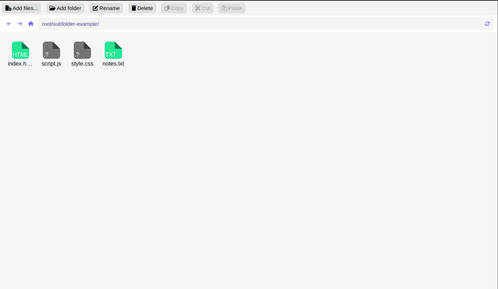

# File Manager App

This is a simple file manager app built using HTML, CSS, and JavaScript. It allows users to perform basic file and folder operations like adding new files/folders, renaming, and deleting.

## Features

- Add new files and folders: Users can create new files and folders by providing a name and selecting the desired location.
- Rename files and folders: Users can rename existing files and folders by selecting the item and entering a new name.
- Delete files and folders: Users can delete files and folders by selecting the item and confirming the deletion.

## Usage

To use the file manager app, follow these steps:

1. Clone the repository: `git clone https://github.com/addevin/filemanager.git`
2. Open the project folder.
3. Launch the app by opening the `index.html` file in your web browser.

## Screenshots

_Example of the file manager interface._
[Visit now](https://addevin.github.io/filemanager/)
## Contributing

Contributions are welcome! If you find any bugs or want to add new features, feel free to submit an issue or a pull request.

## License

This project is licensed under the MIT License. You can find more details in the [LICENSE](LICENSE) file.

